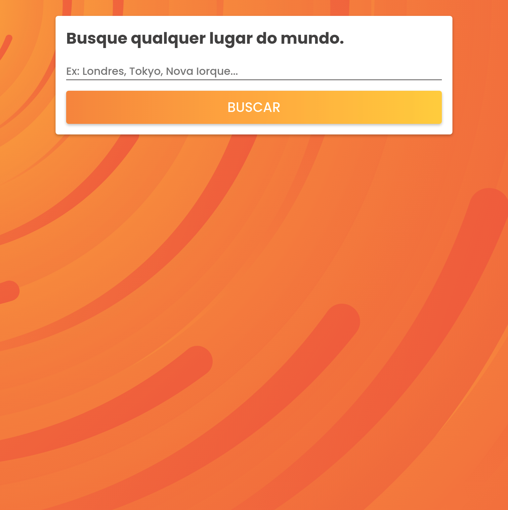

# Stormae

---

## 🔖 Content Table

- [📕 About](#📕-about)
- [⚒️ Used Technologies](#⚒️-used-technologies)
- [✨ Features](#✨-features)
- [🤝Be a Contributor](#🤝-be-a-contributor)
- [🔓 License](#🔓-license)

---

## 📕 About

Stormae is a weather checking app built with Typescript. It's main purpose is learning some of the features of Typescript.

---

## ⚒️ Used Technologies

To develop this app, I used these technologies:

- HTML5
- CSS3
- Typescript
- Workbox
- PostCSS
- Webpack

---

## ✨ Features

- Responsivity
- Get weather data from all the world
- PWA features such as offline mode and fast responses

---

---

## 🤝 Be a Contributor

Have any idea that can help boost the project, and want to share it? It's simple!

1. Fork the project
2. Modify what you want
3. Commit the changes
4. Open a Pull Request

---

## 🔓 License

This project is under MIT license. Click [here](./LICENSE.md) for details.
